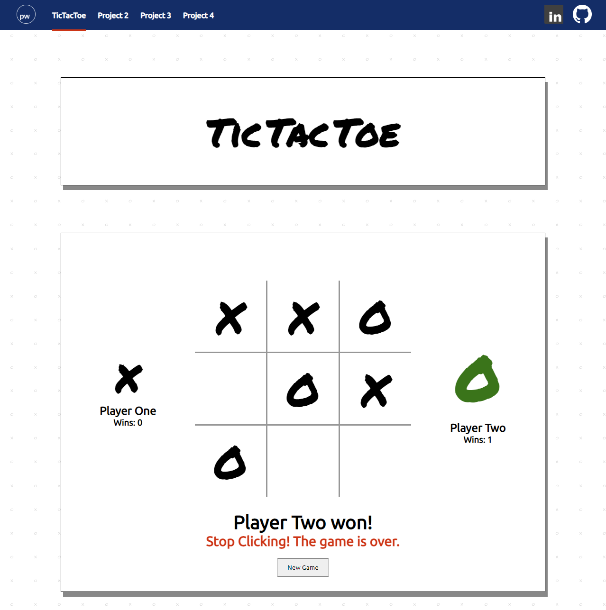

# Tic Tac Toe :x::o::x:
The first project of my Software Engineering Immersive Course. The goal is to build the beloved TicTacToe game where the aim is to have 3 of the same symbol in a line on the board to win.<br/> 
Date Received: 22/11/22<br/>
Date Due: 25/11/22

## :computer: [Click here](https://pwong-it.github.io/Project-1_TicTacToe/) to see my live project!

## :page_facing_up: About
The below are the criteria set out by the course that I will need to meet:
### Technical Requirements
The app that I am building must:
- Render a game in the browser
- Switch turns between more than one player
- Design logic for winning & visually display which player won
- Include separate HTML / CSS / JavaScript files
- Stick with KISS (Keep It Simple Stupid) principles
- Use Javascript for DOM manipulation
- Deploy your game online, where the rest of the world can access it
- Use semantic markup for HTML and CSS (adhere to best practices)

### Necessary Deliverables (Minimum Viable Product)
- At least one artefact of either pseudocode, flow diagram, wireframe demonstrating planning 
- A working game, built by you, hosted somewhere on the internet
- A link to your hosted working game in the URL section of your GitHub repo
- A git repository hosted on GitHub, with a link to your hosted game, and frequent commits dating back to the very beginning of the project
- A readme.md file with explanations of the technologies used, the approach taken, installation instructions, unsolved problems, etc.

### Bonus extensions - Optional
- Keep track of multiple game rounds with a win counter :white_check_mark:
- Allow game customizable options, time limits, board size, game rounds, name & profiles etc
- Allow players to customize their token (X, O, name, picture, avatar etc)
- Get inventive with your styling - research CSS effects, animations to spiff things up :white_check_mark:
- Research LocalStorage or SessionStorage to persist data locally to allow games to continue after page refresh or loss of internet connectivity
- Use timers to display "waiting..." messages while users are waiting to be matched
- Research web audio API and add sound effects to your game
- Be creative! Bend the rules and give it a twist!

Extras
- Added Nav bar - links to future projects, linkedIn, and Github :white_check_mark:
- Added custom font - permanent marker :white_check_mark:
- Added custom background :white_check_mark:
- Added shadow border :white_check_mark:
- Added a hover for the grid "X" and "O" so it grows slightly bigger when hovering over the characters :white_check_mark:
- Player One/Two avatars on the side get bigger if it is that players turn. Colour is also changed. :white_check_mark:
- The winner avatar is big, also is green :white_check_mark:
- The "stop clicking" message now has a shaking animation :white_check_mark:
- Title has a bounce animation upon load of the webpage. :white_check_mark:
- Added hover colour to nav bar project links :white_check_mark:
- Made the title into separate H1 tags. Then animated each word with a slight delay so that the animation bounce matches how you would say the word Tic Tac Toe. Only animates when webpage opens/refreshes. :white_check_mark:
- Added target="_blank" rel="noopener noreferrer" to linked pages so the clicked pages will open in a new tab. :white_check_mark:
 
## :pencil2: Planning & Problem Solving
### General Plan

Use the Problem Solving Process framework to break down the project into manageable components. From Technical Requirements & Necessary Deliverables
1.  Keywords 
    - Game will be on browser :white_check_mark:
    - Switch Turns for players :white_check_mark:
    - Logic for Winning :white_check_mark:
    - Displaying which player won :white_check_mark:
    - Separate HTML/CSS/JS files :white_check_mark:
    - JS for DOM manipulation :white_check_mark:
    - Deploy :white_check_mark:
    - Use semantic Markup :white_check_mark:
2.  Requirements
    - Two players. Player turns will alternate until game over.
    - Grid columns and rows (via CSS)
        - Each grid box will have individually declared ID
    - Event Listeners to listen to user clicks
        - After being clicked, the grid should have a new classList "X" or "O" depending on which player clicked. The changes will be linked to CSS styles
    - Win condition is if 3 of the same symbol in a row
        - Figure out all different scenarios of winning
        - Will need an "if" statement to check if grids in a line (eg 1, 2, 3) have been changed to the same classList. If so, then game is won by that player.
        - If there are no 3 grids in a row that have changed to the same classList after all the grids have been activated, then there is a DRAW.
    - Display who wins at the end
    - Stop any more clicks after the game is over. 
        - Once game has stopped. Any further clicks in the grid will result in a message appearing on webpage. 
        - Clicks will won't have any effect besides activating the message
3.  Tasks (pseudo code in order)<br/>
    Part ONE - Grid
    - Create html, css, js files and link them together
    - Set out basic HTML page. Have all elements ready for DOM manipulation. Heading and Grid at this stage. CSS will be needed for the grid. 
    <img src="./images/photo-sketch.jpg"
    - Declare each of the grids into variables using query selector
    - Test each one to make sure the elements are able to "listen" to the click. 

    Part TWO - Players
    - There are two players. Add html elements in.
    
    - The turns alternate between the two players. The game will run on a for loop until someone wins, or there is a draw
    - The maximum number of turns in this game is 9 turns. (in the for loop, i = 1; i < 10; i++)
    - Since it is alternating turns, playerOne will start first. (i) will represent the turn. 
    - We will need the modulus operator where even number (i) will be playerTwo's turn. i % 2 === 0
    - We will hard code playerOne as "X", playerTwo as "O" for now. 
    - An "if" statement is required to put this together. If (i) is odd, it is playerOne's turn, and whichever grid is clicked, it will turn "X". If (i) is even, it will be playerTwo's turn and the grid clicked will turn "O".
    ```
    // for (var turn = 1; turn < 10; turn++) {
    //     if (turn % 2 === 0) {
    //         console.log(turn)
    //     } else {
    //         console.log(turn)
    //     }
    // }
    // The console has printed the turn numbers from 1 to 9 in order. So we know this is working fine. 
    Now we can replace the turns with "X" and "O"
    for (var turn = 1; turn < 10; turn++) {
        if (turn % 2 === 0) {
            console.log("O")
        } else {
            console.log("X")
        }
    }
    ```
    
    Image:Browser console log of the alternating turns.

    Part THREE - Event Listener
    - Create an event listener for the parent of the grid and declare new variables for the children as the event.target. 
    - Make sure that the event does not activate if clicked outside of the whole grid (use if statement)
    - Test the click first by changing the background colour.
    
    - Remove the numbers in the grids
    - Instead, put "" so that it is empty
    - We can change the textContent of the grid after the click. We will change it to "X" for now.
    ```
    parent.addEventListener('click', function (event) {
        var indGrid = event.target
        indGrid.textContent = 'X'
    })
    ```
    

    Part FOUR - Add Loop
    - ~~Wrap the 'for' loop (previously established in part TWO) with the event listener. ~~
    - A 'for' loop was not required. 
    - Instead of console logging the turn number, change it so that it changes the textContent to the respective player's symbol "X" or "O"
    - Once the loop finishes (when 9 turns are complete), there should be a message on the webpage that says the game is over. We won't have a winning condition for now.
    - Console log the message first and make sure it will work once all grids are filled.
    
    - Message of game over will be shown below the grid. Create HTML section for this game-over message.
    - Create CSS styles so that classLists can be changed.
    - The Game over message can be hidden in transparent colour first, once the game is over, the colour can change to something opaque. 
    
    Image: During game
    
    Image: After game ends


    Part FIVE - Win Condition
    - There are 8 possible ways to win. They all require to have 3 of the same symbol in a straight line. 
    - Each grid box has a corresponding id number. Starting left to right, top to bottom. 
    - List out each scenario with corresponding numbers
    - Write the if statements and also the winning message. 
    - Once the game is over, the user should not be able to activate another grid box. 
    - Have additional message telling users 
    - Have new game button to reset everything
    - Only reveal new game button after a winner has been declared. No cheating by resetting before game finish.
    - Build tally of wins
    '


    Part SIX - CSS Styling and Transitions/Animations
    - Create a clean looking webpage
    - Do not overdo it on colours and crazy animations
    - Use KISS methodolgy
    '
    

4.  Implement - Coding Journey and debugging.<br/> 
    Below are some "highlights" where problems arose and how I dealt with this problems. <br/> 
    ```
    // Part THREE
    // Now we need to create the event listener that will listen for a click by the user. 
    For now, there will not be two players and we will just test that the click works first.
    // Event.target will be used as we won't know what exactly the user will click on.
    // First, the parent of the grid will be declared
    // var parent = document.querySelector('.grid-box')
    // Now to add the event listener to the parent and delcare a new individual grid variable as event target. 

    // parent.addEventListener('click', function (event) {
    //     var indGrid = event.target
    //     indGrid.style.background = 'red'
    // })

    // I have put the background to change to red as a test. 
    What I have found was since I have restricted the width of the entire gridbox in the CSS, there is not extra space around the gridbox that the user could mistakenly click on which would in turn colour the whole gridbox at once. 
    // The numbers in the grid will be removed. What we want is to replace the empty "" with "X". 
    // print a grid in the console to see if it recognises the box content as "". 
    // one.textContent
    // => ''
    // Now instead of changing the box background to red, we will replace the empty textContent from '' to 'X'. 

    // parent.addEventListener('click', function (event) {
    //     var indGrid = event.target
    //     indGrid.textContent = 'X'
    // })

    // It actually does not require it to be replaced, it can be added immediately.
    ```

    Part FOUR was where I had the biggest problem. I had initially thought that a 'for' loop was required to run through the game. But because we only want one thing to happen per user click, a 'for' loop is not required. <br/> 
    Some other problems that occured at this stage were:
    -   The textContent replaces the previous symbol if clicked multiple times
    -   Turn counter increases even if user clicks on the same grid.
    See below for detailed code:
    ```
    // Part FOUR
    // We will now wrap the 'for' loop (from part TWO) with the event listener. 
    // If it is playerOne's turn, it should change the textContent to "X", and "O" for playerTwo

    // parent.addEventListener('click', function (event) {
    //     var indGrid = event.target
    //     for (let turn = 1; turn < 10; turn++) {
    //         if (turn % 2 === 0) {
    //             indGrid.textContent = 'O'
    //         } else {
    //             indGrid.textContent = 'X'
    //         }
    //     }
    // })

    // This is not working. It is just changing the content to "X". 
    Let's try simplifying it and let it consolelog "one" and "two" on the click

    // parent.addEventListener('click', function (event) {
    //     var indGrid = event.target
    //     for (let turn = 1; turn < 10; turn++) {
    //         if (turn % 2 === 0) {
    //             console.log('two')
    //         } else {
    //             console.log('one')
    //         }
    //     }
    // })

    // The browser console is logging correctly. 
    However, I realised that based on what I have programmed, there is only one click and the loop is running 9 times. 
    The console.log is returning one,two,one,two etc
    // I will need to test this without the loop. 
    // The turn variable will need to be declared at the start
    // console log each turn to make sure it is running in order
    // The turn should increase by 1 at the end of each click

    // var turn = 1
    // parent.addEventListener('click', function (event) {
    //     var indGrid = event.target
    //     console.log(turn)
    //     if (turn % 2 === 0) {
    //         indGrid.textContent = 'O'
    //     } else {
    //         indGrid.textContent = 'X'
    //     }
    //     turn = turn + 1
    // })

    // The code works in alternating the "X" and "O". However there are a few evident problems:
    // 1. The user can click on the same grid twice, and it will change the symbol. 
    We will need to prevent it from changing once it's been changed already.
    //  - Can try changing the classList instead of textContent. 
    //  - Initial classList will be "empty". 
    //  - Once the user has clicked on a specific grid, the classList should replace to either "SymOne" or "SymTwo"
    //  - New CSS style will need to be created. Let's put a simple background color change first to make any changes obvious
    //  - The 'if' statement should have an && to specify to only change only if even/odd AND the classList is "empty"
    // 2. The game still needs to stop after the 9 turns have been completed. 

    // Check browser console:
    // one.classList
    // => DOMTokenList [value: 'empty']

    // var turn = 1
    // parent.addEventListener('click', function (event) {
    //     var indGrid = event.target
    //     console.log(turn)
    //     if (turn % 2 === 0 && indGrid.classList[0] === 'empty') {
    //         indGrid.classList.replace('empty', 'symTwo')
    //         indGrid.textContent = 'O'
    //     } else if (turn % 2 !== 0 && indGrid.classList[0] === 'empty') {
    //         indGrid.classList.replace('empty', 'symOne')
    //         indGrid.textContent = 'X'
    //     }
    //     turn = turn + 1
    // })

    // This fixes the problem where the textContent is replaced each time it is clicked. 
    The classList is also replaced as seen in the browser console. 
    // The next problem is the turn counter increases even if the user clicks on the same grid multiple times. 
    To fix this, we will need to put the (turn = turn + 1) at the end of the if/else if statements

    // var turn = 1
    // parent.addEventListener('click', function (event) {
    //     var indGrid = event.target
    //     console.log(turn)
    //     if (turn % 2 === 0 && indGrid.classList[0] === 'empty') {
    //         indGrid.classList.replace('empty', 'symTwo')
    //         indGrid.textContent = 'O'
    //         turn = turn + 1
    //     } else if (turn % 2 !== 0 && indGrid.classList[0] === 'empty') {
    //         indGrid.classList.replace('empty', 'symOne')
    //         indGrid.textContent = 'X'
    //         turn = turn + 1
    //     }
    // })

    // This solves the doubling up effect problem. 
    The only outstanding problem thus far is to end the game as soon as all the grids are NOT empty.
    // The turn number will not go above 10, as our defined "if" statement prevents any additional
     clicks after all boxes are filled to run the code and thereby increasing the turn number by 1. 
    // During the very last turn, the turn will increase to 10 as that is part of the actions of the "if" statement. 
    Once it reaches 10, there should be a message that says game over. 
    When TTT games reach the last turn, it is a draw so the message will reflect this.

    // var turn = 1
    // parent.addEventListener('click', function (event) {
    //     var indGrid = event.target
    //     console.log(turn)
    //     if (turn % 2 === 0 && indGrid.classList[0] === 'empty') {
    //         indGrid.classList.replace('empty', 'symTwo')
    //         indGrid.textContent = 'O'
    //         turn = turn + 1
    //     } else if (turn % 2 !== 0 && indGrid.classList[0] === 'empty') {
    //         indGrid.classList.replace('empty', 'symOne')
    //         indGrid.textContent = 'X'
    //         turn = turn + 1
    //     }
    //     if (turn === 10) {
    //         console.log('gameover')
    //     }
    // })

    // Let's declare a new variable for the message: 
    // var endGame = document.querySelector('#end-message')
    // console.log(endGame)


    // var turn = 1
    // parent.addEventListener('click', function (event) {
    //     var indGrid = event.target
    //     console.log(turn)
    //     if (turn % 2 === 0 && indGrid.classList[0] === 'empty') {
    //         indGrid.classList.replace('empty', 'symTwo')
    //         indGrid.textContent = 'O'
    //         turn = turn + 1
    //     } else if (turn % 2 !== 0 && indGrid.classList[0] === 'empty') {
    //         indGrid.classList.replace('empty', 'symOne')
    //         indGrid.textContent = 'X'
    //         turn = turn + 1
    //     }
    //     if (turn === 10) {
    //         endGame.textContent = "It's a Draw. Good Game, Well Played!"
    //     }
    // })
    // Now that this works, the next step will be to design the winning conditions
    ```

    For part FIVE, I tackled the winning condition. This step was relatively easy, however, it took a lot of code to accomplish it. I saw a lot of repetition so I decided to create a function which decreased the number of lines of code from 50 to 15 lines. <br/> 
    Some of the problems that arose at this stage:
    ```
    //  Winning condition is working. However there are a few problems:
    //  1. There is major repetition and a function would be best to decrease the size of code required.
    //  2. Users are able to click on grids and activate them after the winner has been announced. 
    //  3. Message to users the game has finished if they keep clicking on the grids after the game finished. 
    //  4. Add New Game button. The grid and messages need to reset. Only reveal new game button after a winner has been declared. No cheating by resetting before game finish
    //  5. Add a tally win score for both players. These will not be reset upon clicking new game. 
    ```

    ### For further details and complete code of the game, please feel free to click into any of the files in the repo.  

## :rocket: Cool tech
- HTML
- CSS
- Javascript
- Canva for background

- Used animations from animate.style website
- Transitions

## :scream: Bugs to fix :bug:
- When clicking multiple times between the grid lines, at random times the whole grid will collapse and a thick black bar will replace it. :white_check_mark:


## :sunglasses: Lessons learnt
1.  `explorer.exe .` - To find where my sei folder is located on my computer. I needed this to place saved images into the project images folder. 
2.  Use the browser console more - I was coding in VSC and then testing it. I would then check the elements and console. What I should be doing more of is typing into the console as there is instant feedback on what is actually happening. By doing this, I was able to grasp the concepts and understand the DOM a lot better.
3.  Tried looking how to caption images using Markdown on github. But not really anything particularly in-built. 
4.  The difference between classList and className. You can add/remove individual classes using classList whilst className wipes out everything and replaces it class entirely.
5.  How to use animations taken from the web.
6.  Using Canva for the first time. Very easy to use and powerful tool. 

## :white_check_mark: Future features
- Optimise the webpage for mobile. 
- Update the links on the page as projects are completed.
- Ability to switch between avatars with arrow toggles 


