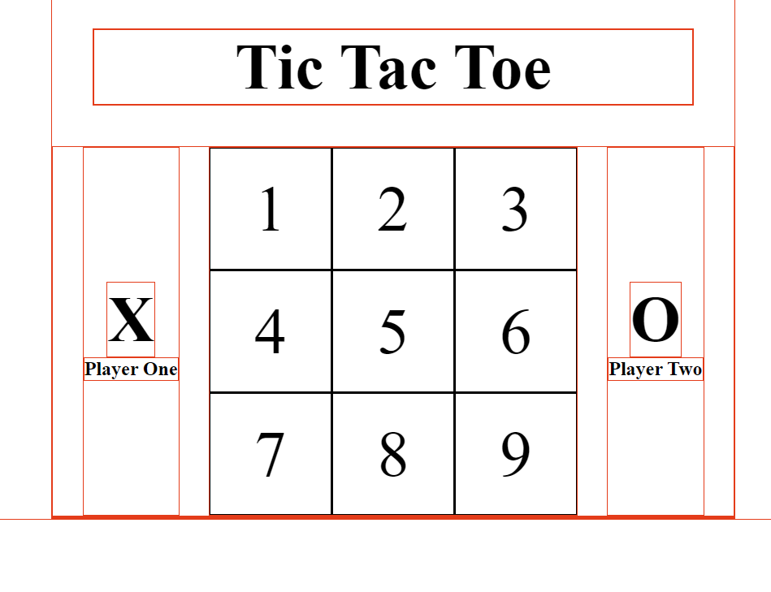
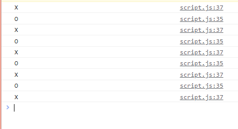
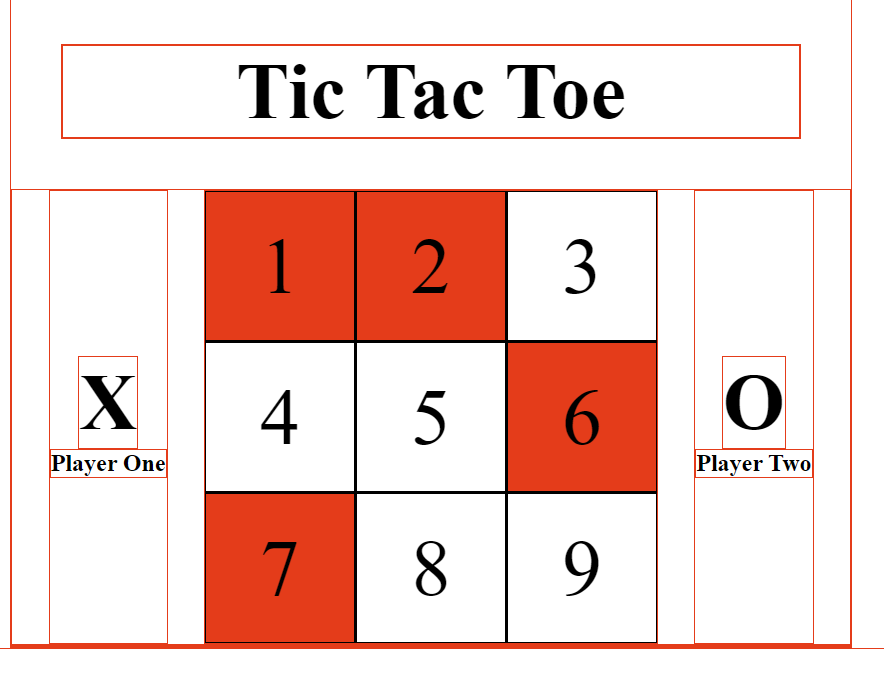
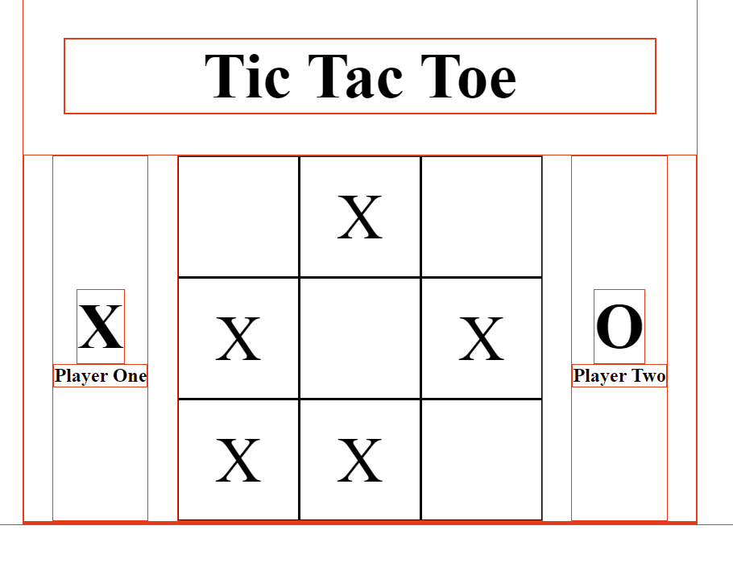
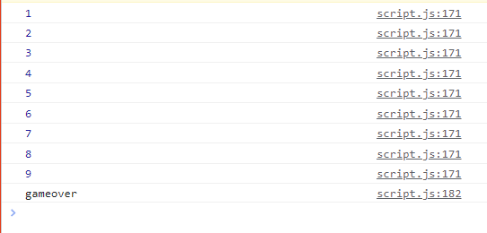
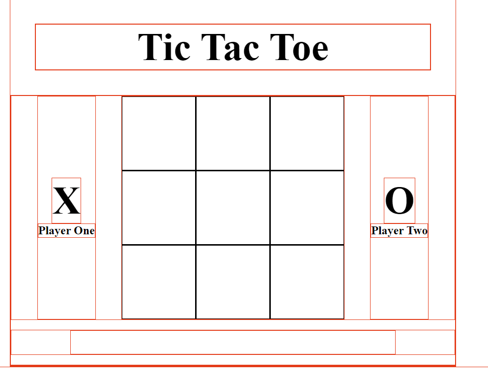
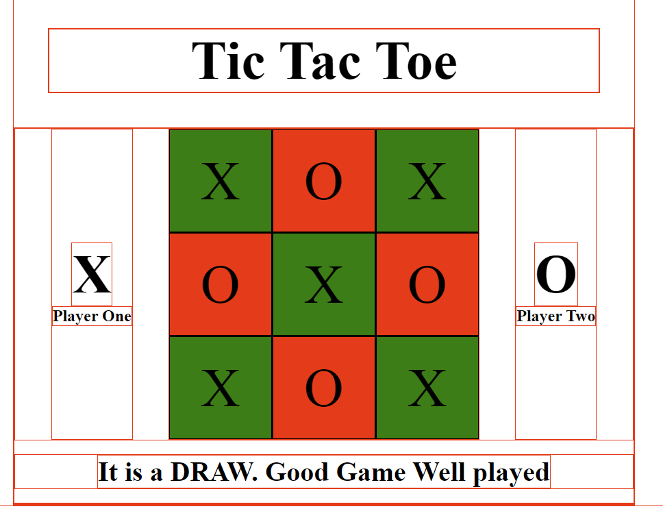
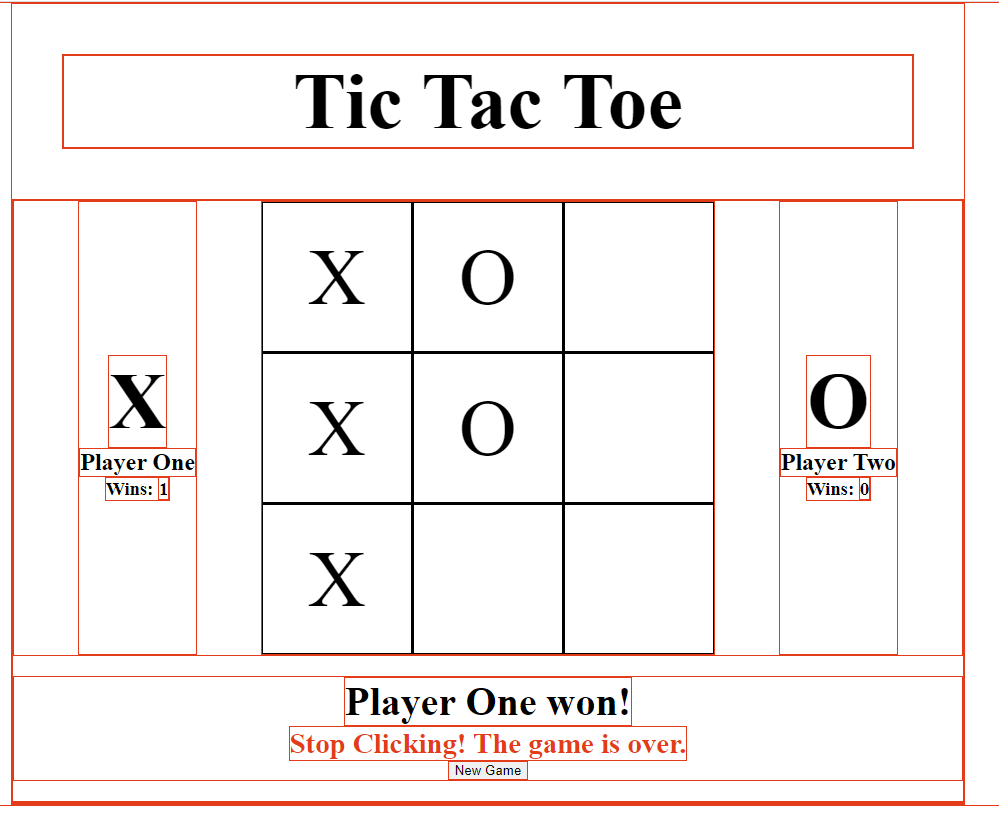
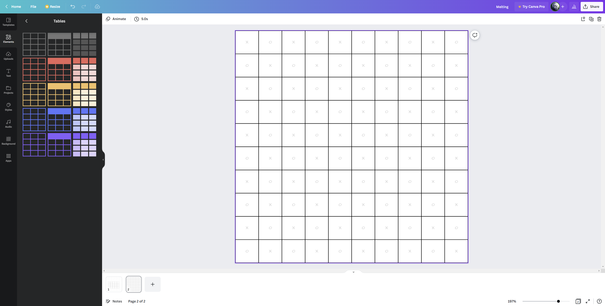
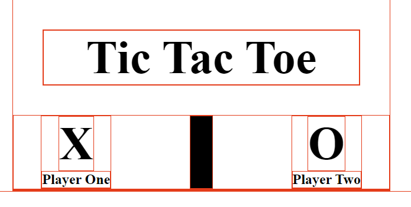

# Tic Tac Toe :x::o::x:
The first project of my Software Engineering Immersive Course. The goal is to build the beloved TicTacToe game where the aim is to have 3 of the same symbol in a line on the board to win.<br/> 
Date Received: 22/11/22<br/>
Date Due: 25/11/22

## :computer: [Click here](https://pwong-it.github.io/Project-1_TicTacToe/) to see my live project!

## :page_facing_up: About
The below are the criteria set out by the course that I will need to meet:
### Technical Requirements
The app that I am building must:
- Render a game in the browser
- Switch turns between more than one player
- Design logic for winning & visually display which player won
- Include separate HTML / CSS / JavaScript files
- Stick with KISS (Keep It Simple Stupid) principles
- Use Javascript for DOM manipulation
- Deploy your game online, where the rest of the world can access it
- Use semantic markup for HTML and CSS (adhere to best practices)

### Necessary Deliverables (Minimum Viable Product)
- At least one artefact of either pseudocode, flow diagram, wireframe demonstrating planning 
- A working game, built by you, hosted somewhere on the internet
- A link to your hosted working game in the URL section of your GitHub repo
- A git repository hosted on GitHub, with a link to your hosted game, and frequent commits dating back to the very beginning of the project
- A readme.md file with explanations of the technologies used, the approach taken, installation instructions, unsolved problems, etc.

### Bonus extensions - Optional
- Keep track of multiple game rounds with a win counter
- Allow game customizable options, time limits, board size, game rounds, name & profiles etc
- Allow players to customize their token (X, O, name, picture, avatar etc)
- Get inventive with your styling - research CSS effects, animations to spiff things up
- Research LocalStorage or SessionStorage to persist data locally to allow games to continue after page refresh or loss of internet connectivity
- Use timers to display "waiting..." messages while users are waiting to be matched
- Research web audio API and add sound effects to your game
- Be creative! Bend the rules and give it a twist!

***I will be thinking of my own extras once I am at that stage. 

## :pencil2: Planning & Problem Solving
### General Plan

Use the Problem Solving Process framework to break down the project into manageable components. From Technical Requirements & Necessary Deliverables
1.  Keywords 
    - Game will be on browser :white_check_mark:
    - Switch Turns for players :white_check_mark:
    - Logic for Winning :white_check_mark:
    - Displaying which player won :white_check_mark:
    - Separate HTML/CSS/JS files :white_check_mark:
    - JS for DOM manipulation :white_check_mark:
    - Deploy :white_check_mark:
    - Use semantic Markup :white_check_mark:
2.  Requirements
    - Two players. Player turns will alternate until game over.
    - Grid columns and rows (via CSS)
        - Each grid box will have individually declared ID
    - Event Listeners to listen to user clicks
        - After being clicked, the grid should have a new classList "X" or "O" depending on which player clicked. The changes will be linked to CSS styles
    - Win condition is if 3 of the same symbol in a row
        - Figure out all different scenarios of winning
        - Will need an "if" statement to check if grids in a line (eg 1, 2, 3) have been changed to the same classList. If so, then game is won by that player.
        - If there are no 3 grids in a row that have changed to the same classList after all the grids have been activated, then there is a DRAW.
    - Display who wins at the end
    - Stop any more clicks after the game is over. 
        - Once game has stopped. Any further clicks in the grid will result in a message appearing on webpage. 
        - Clicks will won't have any effect besides activating the message
3.  Tasks (pseudo code in order)<br/>
    Part ONE - Grid
    - Create html, css, js files and link them together
    - Set out basic HTML page. Have all elements ready for DOM manipulation. Heading and Grid at this stage. CSS will be needed for the grid. 
    <img src="./images/photo-sketch.jpg"
    - Declare each of the grids into variables using query selector
    - Test each one to make sure the elements are able to "listen" to the click. 

    Part TWO - Players
    - There are two players. Add html elements in.
    
    - The turns alternate between the two players. The game will run on a for loop until someone wins, or there is a draw
    - The maximum number of turns in this game is 9 turns. (in the for loop, i = 1; i < 10; i++)
    - Since it is alternating turns, playerOne will start first. (i) will represent the turn. 
    - We will need the modulus operator where even number (i) will be playerTwo's turn. i % 2 === 0
    - We will hard code playerOne as "X", playerTwo as "O" for now. 
    - An "if" statement is required to put this together. If (i) is odd, it is playerOne's turn, and whichever grid is clicked, it will turn "X". If (i) is even, it will be playerTwo's turn and the grid clicked will turn "O".
    ```
    // for (var turn = 1; turn < 10; turn++) {
    //     if (turn % 2 === 0) {
    //         console.log(turn)
    //     } else {
    //         console.log(turn)
    //     }
    // }
    // The console has printed the turn numbers from 1 to 9 in order. So we know this is working fine. Now we can replace the turns with "X" and "O"
    for (var turn = 1; turn < 10; turn++) {
        if (turn % 2 === 0) {
            console.log("O")
        } else {
            console.log("X")
        }
    }
    ```
    
    Image:Browser console log of the alternating turns.

    Part THREE - Event Listener
    - Create an event listener for the parent of the grid and declare new variables for the children as the event.target. 
    - Make sure that the event does not activate if clicked outside of the whole grid (use if statement)
    - Test the click first by changing the background colour.
    
    - Remove the numbers in the grids
    - Instead, put "" so that it is empty
    - We can change the textContent of the grid after the click. We will change it to "X" for now.
    ```
    parent.addEventListener('click', function (event) {
        var indGrid = event.target
        indGrid.textContent = 'X'
    })
    ```
    

    Part FOUR - Add Loop
    - ~~Wrap the 'for' loop (previously established in part TWO) with the event listener. ~~
    - A 'for' loop was not required. 
    - Instead of console logging the turn number, change it so that it changes the textContent to the respective player's symbol "X" or "O"
    - Once the loop finishes (when 9 turns are complete), there should be a message on the webpage that says the game is over. We won't have a winning condition for now.
    - Console log the message first and make sure it will work once all grids are filled.
    
    - Message of game over will be shown below the grid. Create HTML section for this game-over message.
    - Create CSS styles so that classLists can be changed.
    - The Game over message can be hidden in transparent colour first, once the game is over, the colour can change to something opaque. 
    
    Image: During game
    
    Image: After game ends


    Part FIVE - Win Condition
    - There are 8 possible ways to win. They all require to have 3 of the same symbol in a straight line. 
    - Each grid box has a corresponding id number. Starting left to right, top to bottom. 
    - List out each scenario with corresponding numbers
    - Write the if statements and also the winning message. 
    - Once the game is over, the user should not be able to activate another grid box. 
    - Have additional message telling users 
    - Have new game button to reset everything
    - Only reveal new game button after a winner has been declared. No cheating by resetting before game finish.
    - Build tally of wins
    '
    
4.  Implement 
  


## :rocket: Cool tech
- HTML
- CSS
- Javascript
- Canva for background


## :scream: Bugs to fix :bug:
- When clicking multiple times between the grid lines, at random times the whole grid will collapse and a thick black bar will replace it.


## :sunglasses: Lessons learnt
1.  `explorer.exe .` - To find where my sei folder is located on my computer. I needed this to place saved images into the project images folder. 
2.  Use the browser console more - I was coding in VSC and then testing it. I would then check the elements and console. What I should be doing more of is typing into the console as there is instant feedback on what is actually happening. By doing this, I was able to grasp the concepts and understand the DOM a lot better.
3.  Tried looking how to caption images using Markdown on github. But not really anything particularly in-built. 
4.  The difference between classList and className. You can add/remove individual classes using classList whilst className wipes out everything and replaces it class entirely.

## :white_check_mark: Future features
Cool things I would add if I can keep working on this


